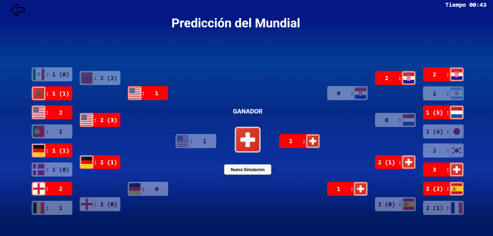

# 🏆 SIMULADOR MUNDIAL 2026

Simulador interactivo del Mundial de Fútbol 2026. Permite visualizar y simular resultados, gestionar grupos y fases eliminatorias, y explorar estadísticas de los equipos.

## 📌 Características
- Simulación de partidos 
- Clasificación automática por grupos 
- Llaves dinámicas en fase eliminatoria 
- Interfaz visual amigable

## 📷 Capturas de pantalla

### 🖥️ Interfaz de simulación

### 🏁 Predicción del torneo

